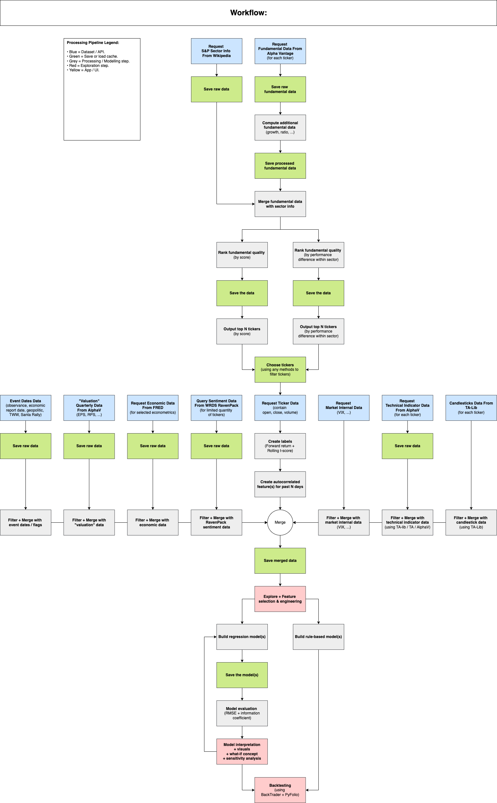

# __MADS CAPSTONE__ 

## __Project Purpose__ 

We have two core assumptions, 1) there are differences in company quality, and although there are differences in each person's judgment of good and bad, it is still possible to find some accepted criteria to distinguish good companies from poor ones; 2) when the market is gripped by fear, investors sell in large numbers and there is an excessive drop in prices; in turn, when the market is encouraged by optimism, there is too much greed, leading to a market bubble; and these excessive reflections are detectable through indicators such as volume, price, etc. Based on the first hypothesis, we will choose some methods, such as the Pitrosky method to score the quality of the company through its financial indicators to find good companies; based on the second hypothesis, we will use some RSI, VIX, and other indicators to discover the market sentiment, so as to find the buy and sell signals. 

--- 

## __Folder Structure__

Folder Name | Description
--- | ---
source/config_py | Contain all the parameter configuration in python. 
source/modules | Contain all the custom functions. 
source/notebooks | Contain all the steps for processing and modelling. 
sh | Contain all the CLI references for executing specific tasks. 
pipfile | For setting up the `pipenv` and tracking all the installed dependencies. 

---

## __Notebook Content__

Notebook Name | Description
--- | ---
... | TBA...

--- 

## __Guide On Initial Setup (Mac Intel)__

1.  Clone the repo to your directory and create a new branch. 

    ```
    git clone https://github.com/lioneltayyd/MADS-CAP.git; 
    git checkout -b dev-name;
    cd MADS-CAP/; 
    git add .; 
    git commit -m "Initiate a new branch."; 
    git push origin; 
    ```

1.  Ensure that you are using python 3.8.5 to avoid any code or dependencies 
    conflict due to version difference. 
    
    Options to download python: 

    -   https://www.python.org/downloads/ (easiest)
    -   https://docs.conda.io/en/latest/miniconda.html (python 3.8) 
    -   https://github.com/pyenv/pyenv#installation 

1.  Run this command to install `pipenv` package. You need to package to 
    install the python packages and dependencies. 

    ```bash
    pip install pipenv; 
    ```

    Ensure that `pipenv` is installed by running `pipenv --version`. 

1.  Next, run the following to activate the virtual environment. All your packages 
    will only made available within this environment. The `pipenv sync` is to ensure 
    that pipenv should match the exact version when installing the packages. You 
    only need to run the `pipenv sync` once. The `pipenv shell` is to activate the 
    virtual environment. Need to run each time you begin working on the project. 

    ```bash
    pipenv sync && pipenv shell; 
    ```

1.  Install `Jupyter` extension on your VSCode or alternative IDE to enable running 
    the notebook directly on your VSCode or IDE without installing `jupyter notebook`. 

1.  For VSCode users, press CMD + SHIFT + P and type `Reload Window` to reload the window after installing
    the python packages. Then press press CMD + SHIFT + P again and type `Select Interpreter` to 
    select the python interpreter `MADS-M2-estimating-news-impact-on-financial-market` 
    to run the notebook. 

--- 

## __Required Data Source Downloads__

1.  Download the `dataset` folder from [Google Drive](https://drive.google.com/drive/u/4/folders/1sgpZq_FNcWTuYZ-bU54LLtaGjtytRJlR) 
    and put them in the the main / root project directory. 

---

## __Processing Workflow & Workload Distribution Diagram__

This is our workflow guide. You can access `processing_flowchart.drawio` inside the `docs/flowchart` folder to view the diagrams. 

 
