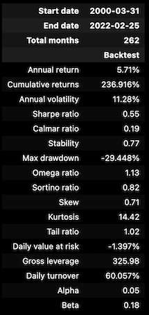
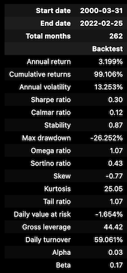

# Exploring and comparing RuleBased algorithmic model against SP500

Yee Dang Tay, Qi Zhang ,Junkyeong Lee 
<!-- @import "[TOC]" {cmd="toc" depthFrom=1 depthTo=6 orderedList=false} -->

<!-- code_chunk_output -->

- [Exploring and comparing RuleBased algorithmic model against SP500](#exploring-and-comparing-rulebased-algorithmic-model-against-sp500)
- [The background](#the-background)
- [The purpose](#the-purpose)
- [Generating Ideas](#generating-ideas)
  - [The Ideas](#the-ideas)
  - [Why Choose S&P 500](#why-choose-sp-500)
- [Sourcing  & Processing Data](#sourcing-processing-data)
  - [How to get fundamental data?](#how-to-get-fundamental-data)
  - [How to Acquire and Process OHLCV data](#how-to-acquire-and-process-ohlcv-data)
- [Backtesting & Evaluation](#backtesting-evaluation)
  - [Features & model approach](#features-model-approach)
  - [Backtesting process](#backtesting-process)
  - [Backtest disclaimer](#backtest-disclaimer)
  - [Generating signals from each feature](#generating-signals-from-each-feature)
  - [Backtesting result](#backtesting-result)
- [Conclusion & the Next](#conclusion-the-next)
- [Team member & the contribution](#team-member-the-contribution)
- [Reference:](#reference)

<!-- /code_chunk_output -->

# The background

When we review the history of investment, we can easily find that quantitative methods have always been valued and used. ****Benjamin Graham ****is widely known as the "father of value investing” and he completed two neoclassical works: *Security Analysis* (1934) with David Dodd, and *The Intelligent Investor* (1949). In his books,  quantitative methods are widely applied,  for example,  “net-net” method [1] which means evaluating companies by using net current assets per share. In nature,  Graham uses statistical methods to filter out those undervalued stocks, then acquire the  margin of safety in his investment.  [2]

In 1952, Harry Markowitz introduced Modern portfolio theory  (MPT ) which is a mathematical framework for assembling a portfolio of assets such that the expected return is maximized for a given level of risk. It is a formalization and extension of diversification in investing, the idea that owning different kinds of financial assets is less risky than owning only one type. Its key insight is that an asset's risk and return should not be assessed by itself, but by how it contributes to a portfolio's overall risk and return. It uses the variance of asset prices as a proxy for risk.[3][4]

Based on Markowitz’s MPT theory,  William Forsyth Sharpe, as one of the originators of the capital asset pricing model (CAPM). CAPM model is used to calculate the valuation of individual stock by using security market line (SML)[5]. 

$$
\cfrac{E(R_i)-R_f}{\beta_i}=E(R_m)-R_f
$$

Where:

- $E(R_i)$ is the expected return on the capital asset
- $R_f$ is the risk-free rate of interest such as interest arising from government bonds
- $\beta_i$ s the sensitivity  of the expected excess asset returns to the expected excess market returns, or also $\beta_i = \frac {Cov(R_i,R_m)}{Var(R_m)}$
- $E(R_m)$ is the expected return of the market

Both Markowitz and Sharpe believe that risk is the source of return, when you fully diversified your portfolio, you will only take the systematic risk. Sharpe further proposed that, in an efficient market where prices should immediately reflect all public information, the individual stock price will be fully discovered by using arbitrage. 

Till 1976, Stephen Ross proposed the arbitrage pricing theory (APT), which is a multi-factor model for asset pricing. APT argues that when opportunities for arbitrage are exhausted in a given period, then the expected return of an asset is a linear function of various factors or theoretical market indices, where sensitivities of each factor is represented by a factor-specific beta coefficient  or factor loading[6][7]. In contrast to the CAPM, it assumes that opportunities for superior returns due to mispricing may exist but will quickly be arbitraged away, and the the expected return of an asset *j*  is a linear  function of the asset's sensitivities to the *n*  factors.

$r_j = \alpha_j + \beta_{j1} f_1 + \beta_{j2} f_2+ \cdot\cdot\cdot +\beta_{jn} f_n + \epsilon_j$

Where:

- $\alpha_j$ is a constant for asset j
- $f_n$ is a systematic factor
- $\beta_{jn}$ is the sensitivity of the jth asset to factor n, also called factor loading,
- and $\epsilon_j$ is the risky asset’s idiosyncratic random shock with mean zero

In 1993, the Eugene Fama Kenneth French proposed three-factor model. In traditional CAPM model, Sharp only consider market risk, and in APT theory Ross has proposed a general multi-factor model, but no more detailed information about those factors.  Fama and French identified additional risk factors: (1) size(small caps) ; (2) valuation (book-to-market ratio). [8][9]

Then two factors was added to CAPM to reflect the portfolio’s exposure to these two classes:

$r = R_f + \beta(R_m -R_f) + b_s*SMB + b_v * HML + \alpha$

Here:

- r is the portfolio’s expected rate of return
- $R_f$ is the risk-free rate of interest such as interest arising from government bonds
- $R_m$ is the return of the market
- The "three factor" *β*  is analogous to the classical *β*  but not equal to it, since there are now two additional factors to do some of the work. *SMB*  stands for "**S** mall [market capitalization] **M**inus **B**ig" and *HML* for "**H**igh [book-to-market ratio] **M**inus **L**ow"; they measure the historic excess returns of small caps over big caps and of value stocks over growth stocks.

Along this line, more and more theories have been discovered and applied, such as: 

- Beneish M-Score: by using financial ratios to check whether the company earnings is manipulated [10]
- Altman Z-Score: by using financial ratios to check the company's likelihood of bankruptcy[11]
- Piotroski F-Score: the score, which is named after Stanford accounting professor Joseph Piotroski, ranges from 0-9 to measure the quality of the company by using financial ratios[12]

Classical modern framework stress that the market is efficient, the market can find the arbitrage quickly and correct it.  We all know the new classical modern framework based on a most important hypothesis the hypothesis of the rational agent[13]. Actually, human beings are imperfect and full of “animal spirit”.  In this context,   it emerges several ****Nobel laureates and great works:

- Herbert A. Simon’s bounded rationality
- Daniel Kahneman  & Vernon L. Smith’s  “Thinking, fast and slow”
- Robert J. Shiller’s “animal spirit”

When we trace back those abovementioned theories,  we can find a clear evolving line, making the map more complete and deeper, which gives us many hints for our work.

# The purpose

The mentioned research is not bouned at the theoretical level and is widely used in real word practice. Those methodologies are widely accepted and used in reality. Typical representatives include:

- AQR([https://www.aqr.com/](https://www.aqr.com/))
- Research Affiliates([https://www.researchaffiliates.com/home](https://www.researchaffiliates.com/home))
- Renaissance Technologies([https://en.wikipedia.org/wiki/Renaissance_Technologies](https://en.wikipedia.org/wiki/Renaissance_Technologies))

We plan to build an investment compass from scratch, to filter out the right company, and pick the right time to invest and exit. The compass is based on two key hypotheses:

- **hypotheses 1**: “In the short run, the market is a voting machine but in the long run, it is a weighing machine.” [14]This quote means that you need to keep your eyes on high-quality companies, not chasing the cigar butts
- **hypotheses 2**:  [Mr.Market](http://Mr.Market) is often irrational and moody. This behavior of Mr. Market allows the investor to wait until Mr. Market is in a 'pessimistic mood' and offers low share price[14]

The roadmap we borrowed from Machine Learning for Algorithmic Trading[15]. Standing on the giant’s shoulder, we divide our process into the following parts:

- generating ideas
- sourcing data & processing data
- extracting features
- tuning machine learning models
- design trading strategies and discover trading signal
- backtesting the model

# Generating Ideas

## The Ideas

Our ideas are based on our two hypotheses. Hypothesis **1** means quality matters. Hypothesis **2** means timing matters.  We believe that high-quality company, in the long haul, can beat the low-quality company. For the mass, fear and greed are the two primary emotions  that motivate the mass to take action or inaction. The kind of mood is really unstable, like a pendulum swing between fear and greed. When it swings to fear, the mass will over-be pessimistic, and choose inaction; once it swings towards greed, the mass will be over-optimistic. Though someone may believe that most of the time the market sentiment is at an equilibrium or midpoint between fear and greed reflecting the real value of the stock market, this is far from the truth.

There are some underlying reasons, such  as:

- institutional bias: the investment managers are usually assessed by quarterly and annual performance, which will lead to short-sight behavior
- herd effect: the institutional investor is fear of being independent, especially when they may make a mistake, and risk being taken as a fool

Considering the over-reaction will make lead to the stock price deviating value, it may lead to high-quality companies being under-valued. In that case, it will need matrics to judge the timing to buy. Just as one of Warren’s most famous quotes is “Be Fearful When Others Are Greedy and Greedy When Others Are Fearful.”

Our team plan to take s&p 500 as our sample. We follow the steps below:

- First, pick the top n companies in every sector from s&p 500
    - By using financial ratios to measure every 500 companies
    - By using different weighting, assess each company and rank
    - According to ranking, pick the top N
- Second, choose the right timing. From our’s personal observation, there are two kinds of timing, valuation timing and momentum timing.
    - For valuation timing, we usually use PE(price/earing), PB(price/bookvalue), PCF(price/cashflow) valuation method to measure. For example, for a company in the past 5 years, there is an 80% probability that the PE ratio drop into the range of 15 to 25.  In practice, we can take this range as the valuation pivot. Once the company’s valuation is lower than 15xPE, we can roughly take it as under-valued.
    - For momentum timing, we usually use technical indicators to help us to make decisions, those indicators usually only contains 3 key information: time, stock price, and trading volume. For example,  the relative strength index(RSI)  is a momentum oscillator that measures the speed and change of the price.

## Why Choose S&P 500

The Standard and Poor's 500  is a stock market index  tracking the stock performance of 503 large companies listed on exchanges in the United States. S&P 500 is a great representative of US stock market, and widely used in practice.

| Items | Description |
| --- | --- |
| Weighting Method | Float-adjusted market cap weighted |
| Rebalancing Frequency | Quarterly in March, June, September, and December |
| Calculation Frequency | Real-time |
| First Value Date | Jan 03, 1928 |
| Number of Constituents | 503 |
| Current Market Cap | US$ 33.5 trillion |

datasource: [http://www.standardandpoors.com/](http://www.standardandpoors.com/)[16]

S&P 500 Index in the past 10 years

S&P 500 Index Micro Sturcter (Sector Market Cap %)

datasource: [http://www.standardandpoors.com/](http://www.standardandpoors.com/)[16]

S&P Valuation Change (PE Mulitple) [17]

datasource: [http://www.econ.yale.edu/~shiller/data.htm](http://www.econ.yale.edu/~shiller/data.htm)[17]

In PE valuation, we adopted Nobel Prize Laureate Rober Shiller’s CAPE data.This data set consists of monthly stock price, dividends, and earnings data and the consumer price index (to allow conversion to real values), all starting January 1871.[17]

# Sourcing  & Processing Data

In the stock market, data plays are important role, it is not simple records of historical facts, but also a driver which can drive the price to go higher or lower. George Soros proposed “reflexivity”[18], in the financial market, it refers to the self-reinforcing effect of market sentiment, whereby rising prices attract buyers whose actions drive prices higher still until the process becomes unsustainable. What makes the investor realize the existence of “gravity”, and the price can’t rocket to the sky? The gravity is the value of the comanpy, and the fuel of the rocket is the emotion. So we plan to categorize our dataset into two types: valuation and emotion. We use the financial accounting data as the representative of valuation, and use OHLCV(open, high, low, close, volume) and text sentiment as the representative of emotion. 

## How to get fundamental data?

The Securities and Exchange Commission (SEC)  requires the listing companies to provide quarterly report (10-Q) and annual report(10-K), which nclude income statment, balance sheet, cashflow sheet and various other regulatory filing requirements. In order to convenient the investor to access to those public information, SEC provides Electronic Data Gathering, Analysis, and Retrieval (EDGAR) system. And they also introduced XBRL, which is a free, open, and global standard for the electronic representation and exchange of business reports. XBRL is in XML format.  But this is really hard, complex, and time-consuming work. If you have interesting to dig deeper, here is the guidebook may be useful([https://www.wisesheets.io/assets/PreparersGuide.pdf](https://www.wisesheets.io/assets/PreparersGuide.pdf)). In order to be more efficient, we stand on the shoulders of others, we use Alpha Vantage API with the following API([https://www.alphavantage.co/](https://www.alphavantage.co/)). Alpha Vantage provides all financial report data.

We use fundamental analysis as a filter, to screen out those high quality companies based on the 4 dimension:

- Grow
- Efficiency
- Profitability
- Safety (we not use in this case, because S&P500 companies seldom have insolvency issues)

In order to dive deeper, we select out the related accounting items we may use in the following analysis, for example, in Grow aspect, we will use “totalRevenue” item.

## How to Acquire and Process OHLCV data

OHLCV data is really easy to acqure. We can get from the following source:

- **Yfinance**
- **Tiingo**
- **IEX**
- **Alpha Vantage**
- **Quandl**

We choose to use Alpha Vantage, especially the adjusted share price. Because of the split, the dividend will change the share price. So we use OHLCV in the following way:

- Use OHLCV individually. We will use simple arithmetic to construct factors to measure the change of variables over time, to measure the ratios between data series etc. There are some most common factors:
    - RSI: relative strength index
    - MACD: Moving average convergence divergence

# Backtesting & Evaluation

## Features & model approach

We are using rule-based model approach to backtest our various strategies. And we do not include any ML model to estimate the forward return for us given the poor performance of the model after some exploration. The error is large and performance variation is too wide and uncertain to make it a reliable model for making estimate. Hence, we will only derive the signals based on specific conditions and indicators. After rounds of exploration on various features, we decided to focus on VIX, MACD, RSI, yield curve, and PE ratio, and do a comparison with S&P. We only explore the long strategy, no short is involved. 

## Backtesting process

The process goes like this. We are focusing less on intraday trade, so the conditions are not adjusted based on daily market activities. Instead, they are somewhat “generalised” and catered to the overall market condition. After we generate the signal based on those conditions, we then backtest the set of stocks we have chosen, and observe and compare the result with S&P. During the backtesting, we only make long trades if the model detects any entry signal (a binary) on each stock. We do not estimate the forward return, hence we will not be able to pick the top N stocks for the trades. We could use the fundamental data as an alternative to sort the stocks by its potential, however due to the limited number of years we can collect, this approach is not viable. Hence, we simply assume an equal weight to each of the stocks. 

The model also does not take risk (the variance) into account, so there is no optimisation between risk and return. The algorithm will either pick all or randomly pick N stocks for long trades. If the model detects signals (== 1) based on the closing values (VIX, MACD, RSI, …) and it will execute the trade on the opening price on the next day. Otherwise, model will close the trades for specific stocks once the signal (== 0) is no longer available. The backtest doesn’t reproduce the exact result (the return) for each run due to the inner-working of “backtrader” library source code, so the result will be estimated by range. 

## Backtest disclaimer

And since we are not training any model, we do not have train-test-split. However, the observation and analysis do not include “future” data (although it has happened and we already known about it), so that when we make assumptions or set the thresholds for the conditions, “future” data will not be included. However, we will backtest on the entire year. The exception to this is the fundamental filtering part where we filter the SP500 stocks based on the recent 5 years of data which include the "future" data. However, since we are only interested in exploring the features and signals, and not performing any actual trade or rigorous research, we decide to compromise this. Furthermore, we aren't interested to spend the money to purchase the 20 years of fundamental data at this stage. 

## Generating signals from each feature

We explored multiple features from variety of sources (WRDS, Yahoo, Fred, TA-Lib, AlphaVantage, ...), but we decided to build a simple rule-based model with the following features to do a quick comparison. 

- __VIX:__ We set the signal to be 1 if the benchmark for VIX to be less than 31 assuming that the higher the VIX, the more volatile the market becomes due to fear although fear may not be the case entirely. VIX somewhat reflects the traders’ perception on the implied volatility of SP500 options within a very a short timeframe. And volatility tends to increase significantly when panic or fear kicks in during a specific period. It’s frequently associate with market downturn also. Hence, to avoid significant drawdown due to high volatility and market fear, the model will close and halt all the trades until the VIX is returned to “normal” conditions. However, we do aware that the volatility between stocks and SP500 can different and uncorrelated. We do not distinguish this part in our model. Although we can pick the defensive stocks instead during those period, we think that the return is not that attractive. Furthermore, the return doesn’t come with very high probability. 
- __MACD:__ We set the signal to be 1 if the line crosses MACD signal within the positive region (both line and signal above 0). We do not set a complicated exit condition for this, so the model will exit the trades if MACD histogram goes beyond a specific threshold. We derive the threshold by observing the approximately 20 years of MACD histogram distribution. If the positive side of the tail is fatter and longer, we then increase the threshold since there’s higher chance of price going higher. Since we do not have an estimation of the forward return to accompany the signal, the model will blindly enters and exits the trade if the condition is met. However, we do accompany this with other conditions like VIX, RSI, … 
- __RSI:__ We set the signal to be 1 if the RSI is below 75. The threshold is also derive from the approximately 20 years of RSI distribution. RSI reflects the momentum of the trades (average gain and loss over a specific period). We want to avoid trading around the overbought region hence the threshold. 

## Backtesting result 

1. __Backtest on top 50 percentile SP500 stocks:__ When we picked the 200 stocks (taken from the 50 percentile after performing a filtering on fundamental data). The return significanly underperform SP500. The reason for the underperformance and low return using the "in and out" approach may be related to the 2nd pointer where we compare the higher vs lower quality stocks. Nonetheless, when we perform a "buy and hold" approach on the 200 stocks starting from year 2000 and hold them for more than 10 years, the result yields a significant return. 

    
    

1. __Backtest on higher vs lower quality stocks:__ When we picked the high quality stocks (AAPL, AMZN, MSFT, JNJ, LMT, JPM, GS), we obtain an annual return of around 4–6% which is roughly equal to the average for SP500. As for medium quality stocks (BA, ATVI, HAL, ETSY, UPS, PWR), we see it underperforms the SP500 with around 2–3%. We know we are leaking the future information into the backtest by selecting the known high quality stocks, but this is to compare the performance difference between the high and medium quality stocks (same features and condition parameters). The conditions and ndicators rely on good quality and stable stocks, so fundamental quality, domain knowledge of the management, and business potential is more important. This is usually obtained via qualitative research instead of quantitative. 

    ---

    ### __Higher quality stocks result:__

    
    

    ---

    ### __Lower quality stocks result:__

    
    

1. __Comparison between ”buy and hold” vs “in and out” approach:__ We also compared the result between “buy and hold” (the selected 200 stocks) and “in and out” approaches on good quality and growing stocks (AAPL, AMZN, MSFT, JNJ, LMT, JPM, GS). The “buy and hold” approach which is around 16% of return outperforms the “in and out” (around 4–6% return) significantly. The “buy and hold” approach will buy stocks at around year 2000 and hold them for around 20 years. Although the “buy and hold” suffers a significant amount drawdown (max 40% above) during recession or market crash, it stills outperform the “in and out” (max drawdown around 25–35%) by a significant degree due to the cumulative compounding effects. Nonetheless, the return from “in and out” approach will be different for options or futures given the difference in scale between stocks and derivatives. 

    
    

# Conclusion & the Next
In general, we try to use the following roadmap:

- select the high quality targets
- generate the signal by using features, such as VIX, MACD, RSI
- compare different investment strategy, buy&hold or in&out
- backtest the strategy

In nature, this is rule-based method, and we truly found that:
- high quality matters
- if you find a high quality companies, you buy and hold will be much beter than seeking sigals to acquire potential short-term return

This conclusion is in consistent with Warren Buffett's investment idea. Just as Carol Loomis, an observer and friend of Warren Buffett for many years, wrote that "... The kind of merchandise that Buffett wants is simply described also 'good business'. To him that essentially means operations with strong franchises, abover-average return on equity, a relatively small need for capital investment,and the capacity therefore to throw off case. This list may sound like motherhoold and apple pie...". 

But we don't think we should stop here. In my view, investing is a combination of science and psychology. Information and the evolving analytical method can help us to better understand the hidden, volatile, and emotional investing world. There are still a lot of things can be continually  dug deeper.

- economic cycle analysis: it can help us to understand how to allocate asset not just in stock but in bond, derevatives, commodities, exchange rate etc
- expand to machine-learning based to find more features in timming selection
- position control analysis: when odds is on your side, you can earn more; when odds is opposite you, you can lose less
- explore more strategy: not just long, but also short

# Team member & the contribution
The whole project is really a team effort. At the beginning, Yee Dang Tay and Qi Zhang were involved in data collection and exploration to get the right data source. Qi Zhang focus on getting reliable fundamental data and trading data, and Yee Dang Tay spent time on generate the whole workflow and collecting more general dataset, which include economy data, emotional data, alternative data etc. Then Qi Zhang use domain knowledge to filter out the high quality stocks. Based on that Yee Dang Tay put huge efforts on feature selecting, and work with Junkyeong Lee in backtest and validation. Along the project progress, all of us work close to each other in brainstorming, data manipulation, visualization, model evaluation, and report writing.

...

# Reference:

1. [*https://www.investopedia.com/terms/n/net-net.asp](https://www.investopedia.com/terms/n/net-net.asp)* 
2. *Graham, B (2003). The Intelligent Investor  HarperBusiness Essentials.*
3. Markowitz, H.M. (March 1952). ["Portfolio Selection"](http://onlinelibrary.wiley.com/doi/10.1111/j.1540-6261.1952.tb01525.x/full) . *The Journal of Finance* . **7**  (1): 77–91. [doi](https://en.wikipedia.org/wiki/Doi_(identifier)):[10.2307/2975974](https://doi.org/10.2307%2F2975974) . [JSTOR](https://en.wikipedia.org/wiki/JSTOR_(identifier))  [2975974](https://www.jstor.org/stable/2975974)
4. Wigglesworth, Robin (11 April 2018). ["How a volatility virus infected Wall Street"](https://www.ft.com/content/be68aac6-3d13-11e8-b9f9-de94fa33a81e). *The Financial Times*
5. [https://en.wikipedia.org/wiki/Capital_asset_pricing_model](https://en.wikipedia.org/wiki/Capital_asset_pricing_model)
6. [The Arbitrage Pricing Theory Approach to Strategic Portfolio Planning](http://www.cfapubs.org/doi/pdf/10.2469/faj.v51.n1.1868), Richard Roll and [Stephen A. Ross](https://en.wikipedia.org/wiki/Stephen_Ross_(economist))
7. [https://en.wikipedia.org/wiki/Arbitrage_pricing_theory#cite_note-3](https://en.wikipedia.org/wiki/Arbitrage_pricing_theory#cite_note-3)
8. [Fama, E. F.](https://en.wikipedia.org/wiki/Eugene_Fama); [French, K. R.](https://en.wikipedia.org/wiki/Kenneth_French) (2012). "Size, value, and momentum in international stock returns". *[Journal of Financial Economics](https://en.wikipedia.org/wiki/Journal_of_Financial_Economics)*. **105**  (3): 457. [doi](https://en.wikipedia.org/wiki/Doi_(identifier)) :[10.1016/j.jfineco.2012.05.011](https://doi.org/10.1016%2Fj.jfineco.2012.05.011).
9. [https://en.wikipedia.org/wiki/Fama–French_three-factor_model#cite_note-FamaFrench1993-4](https://en.wikipedia.org/wiki/Fama%E2%80%93French_three-factor_model#cite_note-FamaFrench1993-4)
10. Messod D. Beneish. ["The Detection of Earnings Manipulation"](https://ru.scribd.com/doc/33484680/The-Detection-of-Earnings-Manipulation-Messod-D-Beneish) . *Scribd* . Retrieved 2017-01-08
11. Caouette, John B; Edward I Altman, Paul Narayanan (1998). *Managing Credit Risk – the Next Great Financial Challenge*, [John Wiley & Sons](https://en.wikipedia.org/wiki/John_Wiley_%26_Sons): New York. [ISBN](https://en.wikipedia.org/wiki/ISBN_(identifier)) [978-0-471-11189-4](https://en.wikipedia.org/wiki/Special:BookSources/978-0-471-11189-4)
12. Stockopedia. ["The Piotroski F-Score: Reviewing Joseph Piotroski's accounting-based value investing screen"](https://www.businessinsider.com/the-piotroski-f-score-reviewing-joseph-piotroskis-accounting-based-value-investing-screen-2011-4). *Business Insider*. Retrieved 2022-03-08
13. Muth, John F. (1961). "Rational Expectations and the Theory of Price Movements". *[Econometrica](https://en.wikipedia.org/wiki/Econometrica)* . **29**  (3): 315–335. [doi](https://en.wikipedia.org/wiki/Doi_(identifier)) :[10.2307/1909635](https://doi.org/10.2307%2F1909635) . [JSTOR](https://en.wikipedia.org/wiki/JSTOR_(identifier))  [1909635](https://www.jstor.org/stable/1909635)
14. ["Mr. Market"](http://news.morningstar.com/classroom2/course.asp?docid=145661&page=4), *Course 504: Great Investors: Benjamin Graham*, [Morningstar, Inc.](https://en.wikipedia.org/wiki/Morningstar,_Inc.), Investing Classroom: Stocks 500, 2015, retrieved August 23, 2019
15. Machine Learning for Algorithmic Trading: Predictive models to extract signals from market and alternative data for systematic trading strategies with Python, 2nd Edition Stefan Jansen
16. [https://www.spglobal.com/spdji/en/indices/equity/sp-500/?indexId=spusa-500-usduf--p-us-l--#data](https://www.spglobal.com/spdji/en/indices/equity/sp-500/?indexId=spusa-500-usduf--p-us-l--#data) (2022-7-17)
17. [http://www.econ.yale.edu/~shiller/data.htm](http://www.econ.yale.edu/~shiller/data.htm)
18. Soros, George (2013). "Fallibility, reflexivity, and the human uncertainty principle". *Journal of Economic Methodology* . **20**  (4): 309–329.